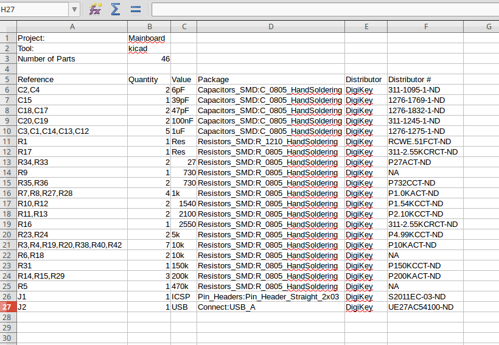

Bill Of Materials Tools
=======================

Command Line tool for converting a Kicad Netlist or an Eagle schematic file to a CSV file in a BOM format.

Sample Usage: 
```
python3 BOMtools.py -i '/Project Files/project.net' \
		    -o '/Path/to/output/' \
		    -t 'kicad' \
		    -w -v
```

```
usage: BOMtools [-h] [--output OUTPUT] [--input INPUT] [--eda-tool EDATOOL]
                [--update UPDATE] [--verbose] [--writeCSV]

optional arguments:
  -h, --help            show this help message and exit
  --output OUTPUT, -o OUTPUT
                        The path for the output csv BOM file
  --input INPUT, -i INPUT
                        The path to the input schematic or netlist file
  --eda-tool EDATOOL, -t EDATOOL
                        Define what EDA tool created the input file
  --update UPDATE, -u UPDATE
                        Update the pricing (Not implemented yet)
  --verbose, -v         Show the verbose output to the terminal
  --writeCSV, -w        Write BOM to CSV file

```

This will output a csv file that can be opened by just about any spreadsheet program. The parts are grouped by the type of part and identical parts. For the output argument, `-o`, do not put the file name. The output file will be `Rootnameofinputfile_BOM.csv`. 



Preparation and Usage (Kicad)
=======================
You must add fields to every part in order to take advantage of having part numbers in your schematic file and exposed in the output of this tool. This can be accomplished this way:
1. In Eeschema click `Preferences` and the `Schematic Editor Options`
2. Then there is a tab at the top of that dialog window called `Template Field Names`
3. Here the fields shuould be "Distributor#" and "Distributor"
4. All of the schematic symbols will have these attributes now and you can edit them by pressing `E` on the symbols
5. I am not sure if there is a way to include fields when creating a symbol in the Library Editor

Preparation and Usage (Eagle)
=======================
You must add attributes to every part in order to take advantage of having part numbers in your schematic file and exposed in the output of this tool. This can be accomplished a few ways:
* In the schematic use the 'attribute' tool built in to Eagle and add attributes one at a time
* In the schematic use Bob Starr's `attrib-add` ulp in his `ulp_user` [Github repo](https://github.com/robertstarr/ulp_user). You can use this to add the same attribute, like "Distributor" to multiple symbols that have been grouped by the group tool. 
* In the part editor add the attributes to the parts there

The attributes to add must be `DISTRUBUTOR` and `DISTRIBUTOR-NUM`


**Disclaimer**: This is still a work in progress. If you use this please compare the CSV output to the expected list.

Some TODO's:
* Detect file automatically
* Make CSV file creation more robust 
* Add pricing capability with the find chips API or something similar
* Add multiple output formats